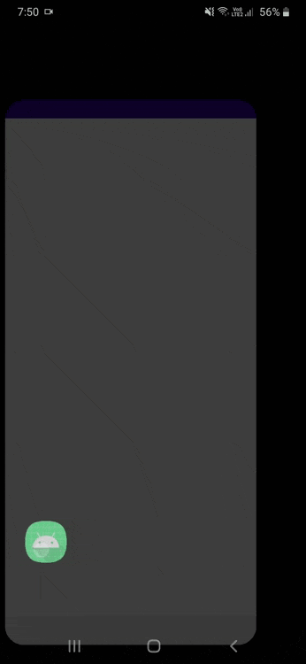

# PremadeRecyclerView

### This is simple RecyclerView component with an easy approach. 
### Normally to render a list of items, we use RecyclerView, and that recyclerview requires an adapter to render the items in it. And to render those items, we need to create viewholder to hold the item inside the adapter.

### It's a longer process. 

### We have seen in flutter it's very easy to render list. Just a ListView widget is enough. Why can't we do something like that in native ?? Well, we can now, with PremadeRecyclerView.

### This component is inspired by flutter's ListView.Builder() widget. 

### In flutter to render a list a items -
``` dart

ListView.builder(
  padding: const EdgeInsets.all(8),
  itemCount: items.length,
  itemBuilder: (BuildContext context, int index) {
    return Container(
      height: 50,
      color: Colors.amber[colorCodes[index]],
      child: Center(child: Text('Entry ${items[index]}')),
    );
  }
);

```

### With PremadeRecyclerView -
#### add premade recyclerview to layout

``` xml

<com.mridx.premaderecyclerview.PremadeRecyclerView
        android:id="@+id/premadeRecyclerView"
        android:layout_width="match_parent"
        android:layout_height="match_parent" />


```

#### now in activity or fragment
``` kotlin
          binding.premadeRecyclerView.apply {
            this.setItemCount(15) //pass items count
            this.onLastItemScrolled {
                // last item is scrolled, load more data or show there's no more new data :D
                this.setItemCount(10) //for example I'm adding another 10 items to the recyclerview
            }
            this.itemBuilder = { parent, index ->
                var view: View? =
                    ItemviewType1Binding.inflate(layoutInflater, parent, false).apply {
                        this.textView.text = "this is a view type 1"
                        this.root.setOnClickListener {
                            Toast.makeText(
                                this@MainActivity,
                                "Clicked on view type 1 View",
                                Toast.LENGTH_SHORT
                            ).show()
                        }
                    }.root
                if (index in 6..9) {
                    view = ItemviewType2Binding.inflate(layoutInflater, parent, false).apply {
                        this.root.setOnClickListener {
                            Toast.makeText(
                                this@MainActivity,
                                "Clicked on view type 2 View",
                                Toast.LENGTH_SHORT
                            ).show()
                        }
                    }.root
                }

                view
            }
            //uncomment below line to render the recyclerview with StaggeredGridLayoutManager
            //this.layoutManager = StaggeredGridLayoutManager(2, RecyclerView.VERTICAL)

            //uncomment below line to render the recyclerview with GridLayoutManager
            //this.layoutManager = GridLayoutManager(this@MainActivity, 2)

            // by default it renders with LinearLayoutManager with vertical orientation
        }.also {
            //render must call after assigning itemBuilder
            it.render()
        }
```

#### This is it. With it we can show multiple view according to the index of item. 



##
## Add it to android studio project

### In project's build.gradle
``` gradle
allprojects {
	repositories {
		...
		maven { url 'https://jitpack.io' }
	}
}
```

### In  app level build.gradle
``` gradle
dependencies {
  ...
  implementation 'com.github.mridx:PremadeRecyclerView:1.0-beta'

}
```

### This is just a component and opensource. You can modify and use it or contribute to make it better.

### Most importantly this will save a lot of time in development :D


